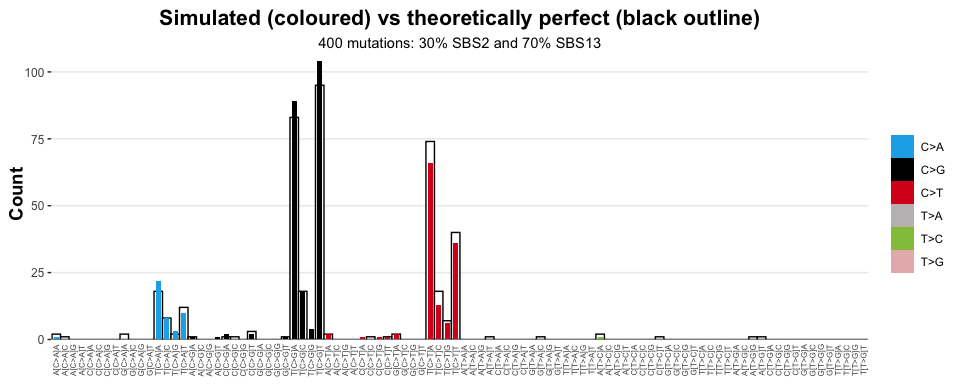

<!-- README.md is generated from README.Rmd. Please edit that file -->

# sigsim 

<!-- badges: start -->

[](https://lifecycle.r-lib.org/articles/stages.html#experimental)
[](https://CRAN.R-project.org/package=sigsim)

<!-- badges: end -->

**sigsim** simplifies simulation of mutational signature catalogues.

**sigsim** is part of the
[**sigverse**](https://github.com/selkamand/sigverse)

sigsim is in early development and not yet ready for use.

## Philosophy

Simulating mutational catalogues is crucial for evaluating the
performance of signature analysis tools. To assess how reliably
signatures can be detected, we use simulated catalogues with known
compositions.

To generate simulated datasets, we first parameterise a multinomial
distribution based on a single mutational signature OR some combination
of multiple mutational signatures. We then randomly sample this
multimonial distribution ‘n’ times (where n = number of mutations we
want to simulate for a sample). It is the randomness of the sampling
which adds noise to profiles.

When simulating a catalogue generated from multiple mutational
signatures, sigsim offers two different approaches, mixture distribution
(generally recommended) and stratified sampling.

For example, to simulate catalogue of 400 mutations where 30% are from
signature 1 and 70% are from signature 2:

**Mixture distribution sampling (**`sig_simulate_mixed`**):**

- Creates a new signature representing a 30%-70% mix of signature 1 and
  signature 2. Samples 400 mutations from this new ‘mixed’ signature.

- On average, 30% of the 400 mutations will be drawn from signature 1,
  and 30% from signature 2. However there will be some random
  sampling-induced variation around these contributions.

- Under this approach, we do NOT know exactly how many mutations are
  from each signature. There is some randomness around the %
  contributions because we have not stratified the sampling.

**Stratified Sampling (**`sig_simulate_stratified`**):**

- Independently sample 120 mutations ($30\% \times 400$) from signature
  1 and 280 ($70\% \times 400$) from signature 2, then combine them
  together.

- Gives us exact knowledge over the balance of signatures in the final
  sample (explicitly enforced to be 120 & 280).

- However, imagine we simulate a catalogue with total of 10 mutations,
  96% from signature 1 and 4% from signature 2, the result would
  **never** include any mutations from signature 2! The mixture
  distribution sampling avoids this this problem. If you simulate enough
  catalogues from a mixed signature, both signatures will end up
  represented.

For some experiments, you may want to create perfect (‘noiseless’)
combinations of two signatures, which sigsim also enables.

You can install the development version of sigsim from
[GitHub](https://github.com/) with:

``` r
# install.packages("devtools")
devtools::install_github("selkamand/sigsim")
```

## Quick Start

### Which Function Should I Use?

| Goal | Use This Function |
|----|----|
| Simulate from 1 signature | `sig_simulate_single()` |
| Simulate from multiple (stochastic) | `sig_simulate_mixed()` |
| Simulate from multiple (fixed proportions) | `sig_simulate_stratified()` |
| Create noiseless catalogue (based on model) | `sig_simulate_perfect()` |
| Create noiseless catalogue (based on single signature) | `sigstats::sig_reconstruct()` |

``` r
library(sigsim) # Signature simulation
library(sigstash) # Signature collections
library(sigvis) # Visualisation of signatures
library(sigstats) # Signature Statistics

# Load signature collections from sigstash
signatures = sig_load('COSMIC_v3.4_SBS_GRCh38')


# Randomly simulate 5 samples, each with 400 mutations, by multinomial random sampling of SBS1
catalogues <- sig_simulate_single(
  signatures[["SBS1"]], 
  n = 400, 
  n_catalogues = 5
)

# Randomly simulate 5 samples, each with 400 mutations, by multinomial random sampling of an underlying reconstructed signature containing 30% SBS1 and 70% SBS3
catalogues_from_model <- sig_simulate_mixed(
  signatures, 
  model = c('SBS2' = 0.3, 'SBS13' = 0.7), 
  n = 400, 
  n_catalogues = 5, 
  seed = 42
)

# Create noiseless signatures (only ever returns 1 catalogue)
perfect_catalogue <- sig_simulate_perfect(
  signatures, 
  model = c('SBS2' = 0.3, 'SBS13' = 0.7), 
  n = 400
)

# Visualise one noise from one sampled profile against a noiseless (perfect) profile
sig_visualise_compare(catalogue1 = perfect_catalogue, catalogue2 = catalogues_from_model[[1]], "count", names = c("Simulated", "Perfect"), title = "Simulated (coloured) vs theoretically perfect (black outline)", subtitle = "400 mutations: 30% SBS2 and 70% SBS13")
#> ✔ All channels matched perfectly to set [sbs_96]. Using this set for sort order
#> ✔ All types matched perfectly to set [sbs_type]. Using this set for sort order
#> ✔ Types matched perfectly to palette [snv_type]
```



### Simulating Datasets for Sensitivity, Inter-Signature Interference, and Overfitting Assessment

The datasets simulated above are well-suited for evaluating
**sensitivity** and **inter-signature interference**. However, if your
focus is on **assessing overfitting**, you may need more control over
the level and type of ‘noise’ added to the model.

#### Simulating Overfitting with Dropped Signatures

Instead of artificially creating a low-similarity signature, another
effective strategy is to simulate mutation catalogues using a
combination of known signatures, but then **drop one signature** when
performing the fitting. If the fitting algorithm attempts to explain the
missing signature by over-relying on other available signatures, it
indicates overfitting.

This method allows you to test how well the algorithm can handle
‘unknown’ components-i.e., real mutational processes that aren’t
represented in your signature collection.
